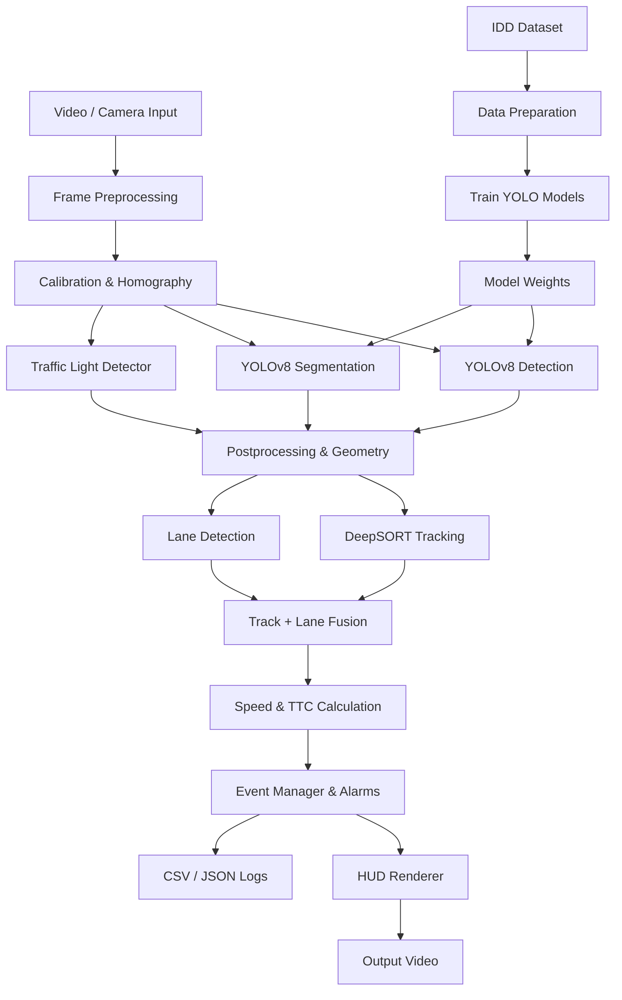

```mermaid
flowchart TB

%% INPUT & PREPROCESSING
A1[Video / Camera Input]
A2[Frame Preprocessing]
A3[Calibration & Homography]

A1 --> A2 --> A3

%% INFERENCE
B1[YOLOv8 Detection]
B2[YOLOv8 Segmentation]
B3[Traffic Light Detector]

A3 --> B1
A3 --> B2
A3 --> B3

%% POSTPROCESSING
C1[Postprocessing & Geometry]
B1 --> C1
B2 --> C1
B3 --> C1

%% TRACKING + LANE
D1[DeepSORT Tracking]
D2[Lane Detection]

C1 --> D1
C1 --> D2

%% FUSION & METRICS
E1[Track + Lane Fusion]
E2[Speed & TTC Calculation]

D1 --> E1
D2 --> E1
E1 --> E2

%% EVENTS & OUTPUT
F1[Event Manager & Alarms]
F2[HUD Renderer]
F3[Output Video]
F4[CSV / JSON Logs]

E2 --> F1
F1 --> F2 --> F3
F1 --> F4

%% TRAINING PIPELINE (OFFLINE)
T1[IDD Dataset]
T2[Data Preparation]
T3[Train YOLO Models]
T4[Model Weights]

T1 --> T2 --> T3 --> T4
T4 --> B1
T4 --> B2
```
